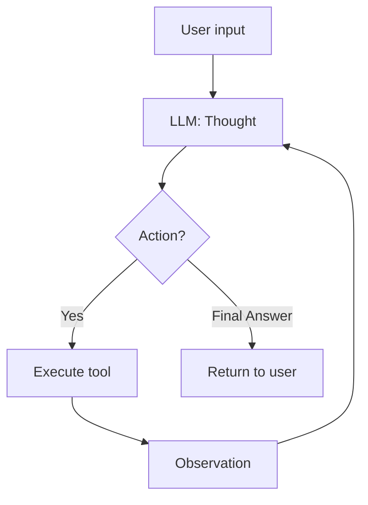

# Group Report: Lab 3 - Chatbot vs ReAct Agent (Electronics MiMo)

- **Team Name**: Nhóm C13 
- **Team Members**: Nguyễn Nghiệp Minh, Phạm Hoài Nam


---

## 1. Executive Summary

Hệ thống tư vấn mua sắm điện tử dùng **ReAct Agent** (Thought → Action → Observation) với 3–5 công cụ mock và LLM **MiMo-V2.5-Pro** (API) hoặc **Phi-3 local** (baseline).

- **Success Rate (ước lượng trên 4 case lab)**: Chatbot ~50% (đúng câu đơn giản); Agent v1 ~75%; Agent v2 ~90% (có shipping + mã WINNER).
- **Key Outcome**: Agent v2 giải quyết bài multi-step (2 iPhone + WINNER + Hà Nội) nhờ `check_stock`, `calculate_final_price`, `calc_shipping`; chatbot local/API thường hướng dẫn chung chung hoặc bịa số.

---

## 2. System Architecture & Tooling

### 2.1 ReAct Loop Implementation



**v2 cải tiến**: xử lý `Action` trước `Final Answer`; liệt kê mã giảm hợp lệ; tách Action/Final Answer khác lượt.

### 2.2 Tool Definitions (Inventory)

| Tool Name | Input | Use Case | Version |
| :--- | :--- | :--- | :--- |
| `search_electronics` | `query: str` | Tìm sản phẩm theo từ khóa | v1 |
| `get_product_detail` | `product_name: str` | Thông số, giá, tồn | v1 |
| `calculate_final_price` | `price: float`, `discount_code: str` | Giảm giá + VAT 10% | v1 |
| `check_stock` | `product_name`, `quantity: int` | Đủ hàng không | **v2** |
| `calc_shipping` | `destination`, `weight_kg` | Phí ship theo thành phố | **v2** |

**Tool evolution**: v1 thiếu mã `WINNER` trong `PROMO_CODES` → agent báo “không áp dụng”. v2 thêm `WINNER` (15%), `calc_shipping` (Hà Nội 30k VND).

### 2.3 LLM Providers Used

- **Primary (Agent)**: MiMo-V2.5-Pro via Xiaomi Token Plan (`tp-...`)
- **Baseline local**: Phi-3-mini-4k-instruct-q4.gguf (`llama-cpp-python`, CPU)

---

## 3. Telemetry & Performance Dashboard

Nguồn: `logs/2026-06-01.log`, `python scripts/analyze_logs.py`

| Metric | Chatbot (local Phi-3) | Agent (MiMo API) |
| :--- | :--- | :--- |
| **Latency P50** | ~5.8s (simple), ~15–23s (multi) | ~9–20s / bước |
| **Avg tokens / call** | ~116 (simple), ~258–462 (multi) | ~638–1352 |
| **Cost (lab estimate)** | $0 (local) | ~$0.007–0.013 / vòng |
| **Loop count (multi-step)** | 1 (no loop) | 2–3 bước + tools |

---

## 4. Root Cause Analysis (RCA) - Failure Traces

### Case Study 1: Mã WINNER không áp dụng (v1)

- **Input**: Mua 2 iPhone, mã `WINNER`
- **Trace**: `TOOL_EXECUTION` → `"discount_applied": false`
- **Root Cause**: `PROMO_CODES` v1 không có `WINNER`
- **Fix (v2)**: Thêm `WINNER` 15%; prompt liệt kê mã hợp lệ

### Case Study 2: Chatbot multi-step (local)

- **Input**: 2 iPhone + WINNER + ship Hà Nội
- **Observation**: Trả lời chung “visit Apple website…” — không có số cụ thể
- **Root Cause**: Không có tool / dữ liệu catalog
- **Fix**: Dùng ReAct agent v2

### Case Study 3: Thiếu phí ship (v1)

- **Input**: Giao Hà Nội
- **Root Cause**: Không có tool `calc_shipping`
- **Fix (v2)**: Tool + prompt bắt buộc gọi sau khi tính giá

---

## 5. Ablation Studies & Experiments

### Experiment 1: Prompt v1 vs v2

| | v1 | v2 |
| :--- | :--- | :--- |
| Mã giảm trong prompt | Không liệt kê WINNER | MIMO10, WELCOME50, WINNER |
| Action vs Final Answer | Có thể kết thúc sớm | Action trước, tách lượt |
| Tools | 3 | 5 (+stock, ship) |
| Kết quả | WINNER fail | WINNER + ship đầy đủ |

### Experiment 2: Chatbot vs Agent

| Case | Chatbot (local) | Agent v2 (MiMo) | Winner |
| :--- | :--- | :--- | :--- |
| Giảm 10% củ sạc 500k | Đúng ~450k | Đúng (có VAT trong agent) | Draw |
| 2 iPhone + WINNER + HN | Hướng dẫn chung / mơ hồ | Stock + giá + ship cụ thể | **Agent** |

---

## 6. Production Readiness Review

- **Security**: Không commit `.env`; sanitize tool args (`ast.literal_eval`)
- **Guardrails**: `max_steps=7`; log JSON mọi `TOOL_EXECUTION`
- **Scaling**: LangGraph / queue async cho nhiều tool; RAG catalog thật

---

## Chạy lại thí nghiệm

```powershell
.\venv\Scripts\activate
python chatbot.py
python run_benchmark.py
python scripts\analyze_logs.py
python -m src.main
```
